# Activity Diagrams 

1. [Add the project](#1) 
2. [Edit the project information](#2) 
3. [Delete the project](#3) 
4. [Add project tasks](#4) 
5. [Edit project tasks](#5) 
6. [Delete project tasks](#6)  
7. [Change the notification format](#7) 
8. [Change the notification period](#8) 
9. [Change the end of the working time](#9) 
10. [Change the start of the working time](#10) 
11. [Done daily task](#11) 

# 1 Add the project 
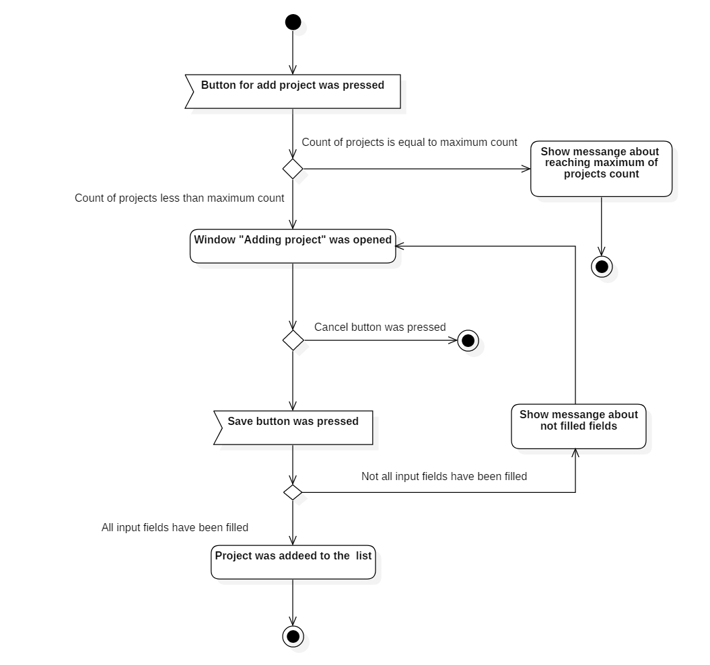

# 2 Edit the project information 
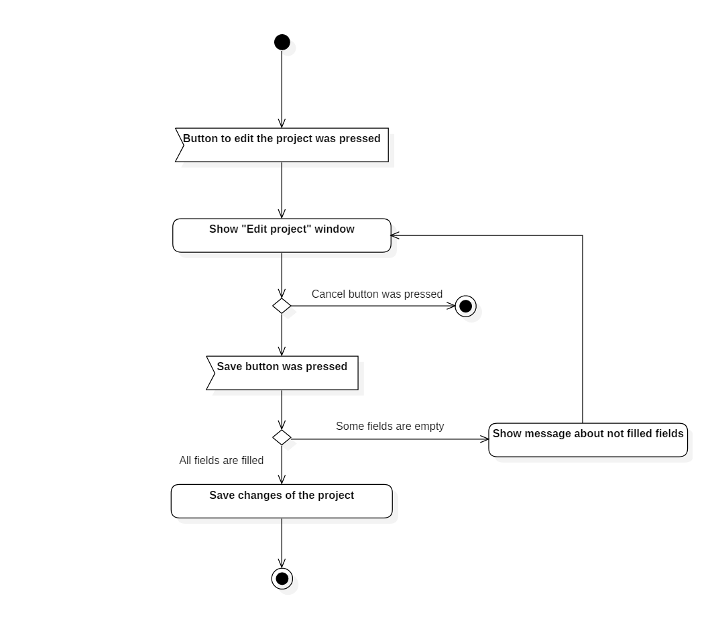

# 3 Delete the project 
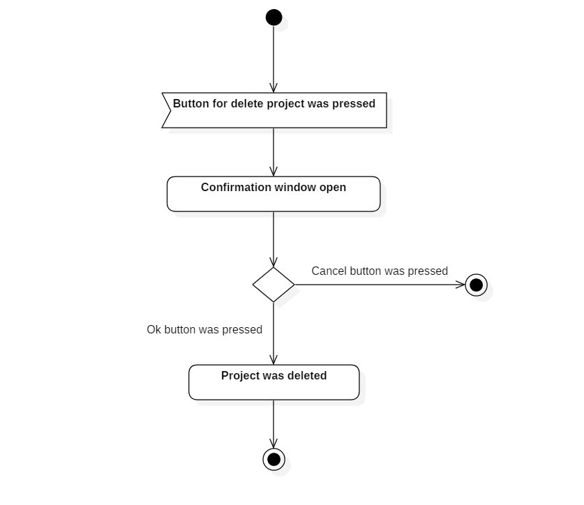

# 4 Add project tasks 
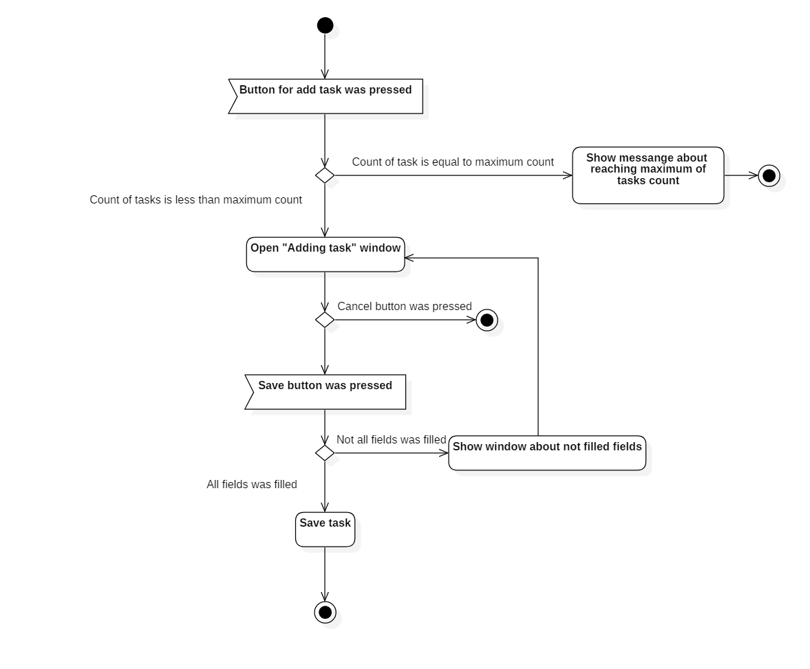

# 5 Edit project tasks 
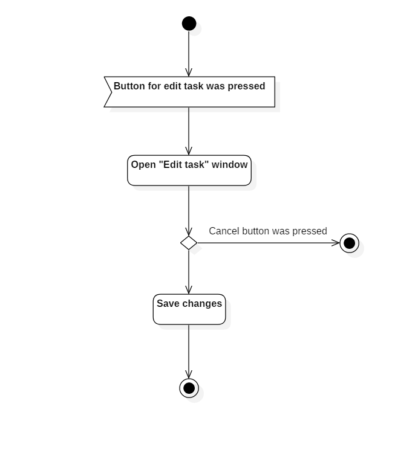

# 6 Delete project tasks 
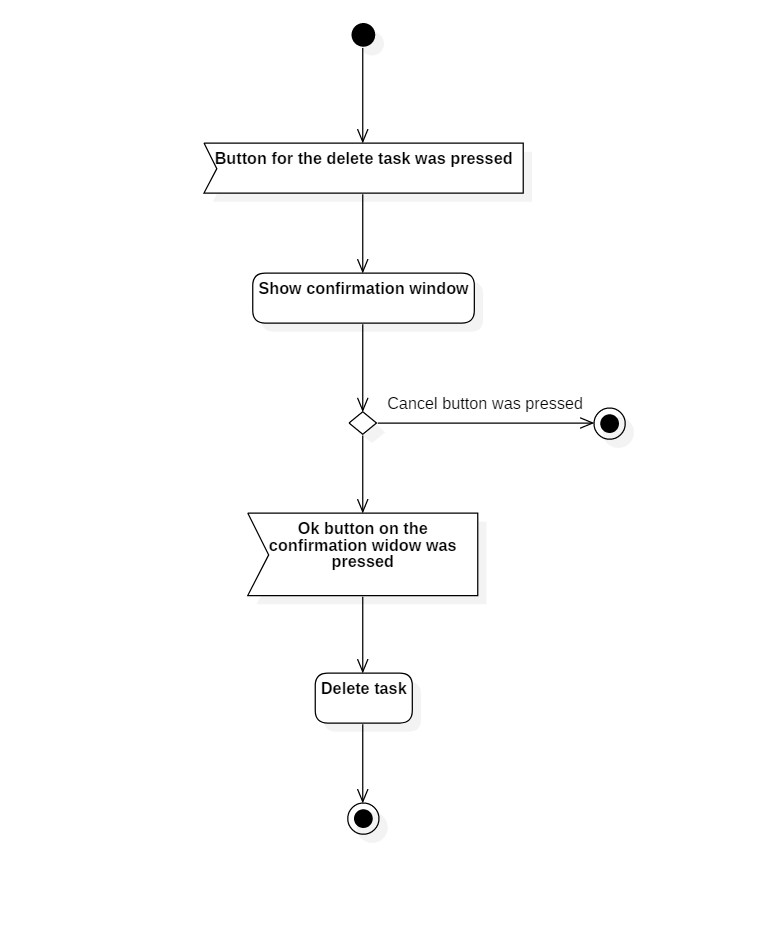

# 7 Change the notification type 
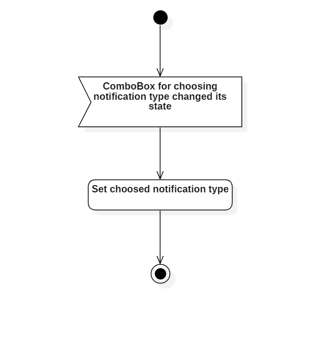

# 8 Change the notification period 
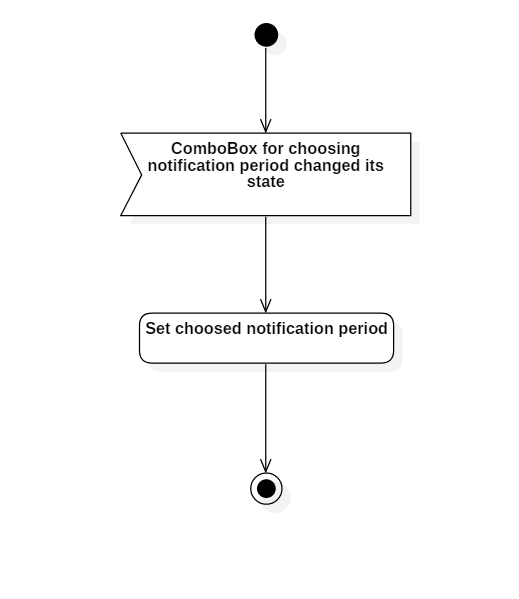

# 9 Change the end of the working time 
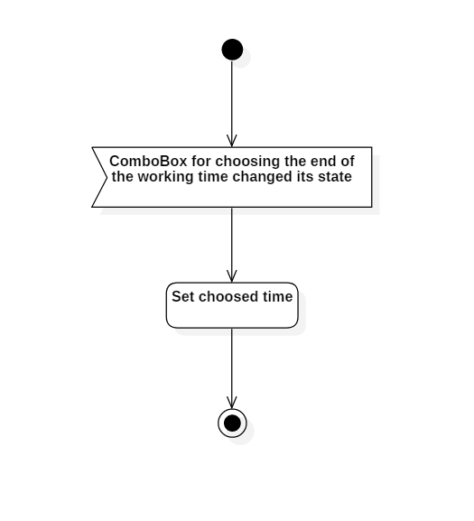

# 10 Change the start of the working time 
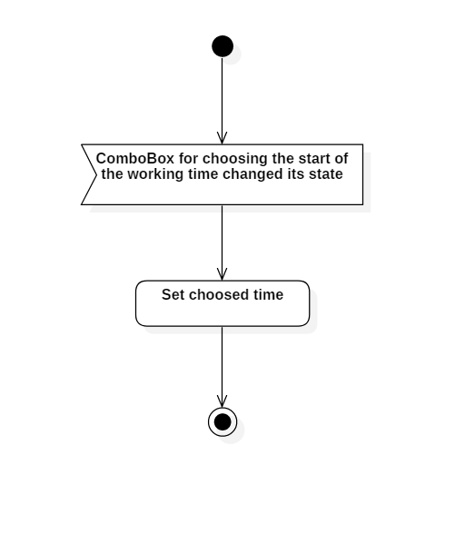

# 10 Done daily task 
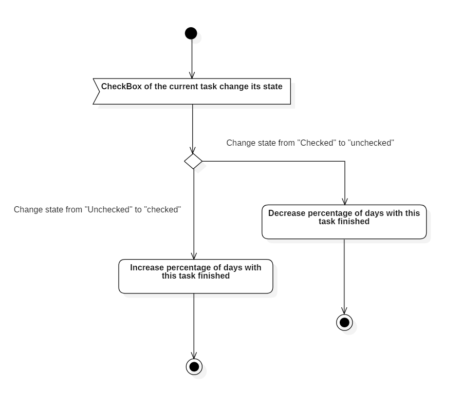

> Written with [StackEdit](https://stackedit.io/).
